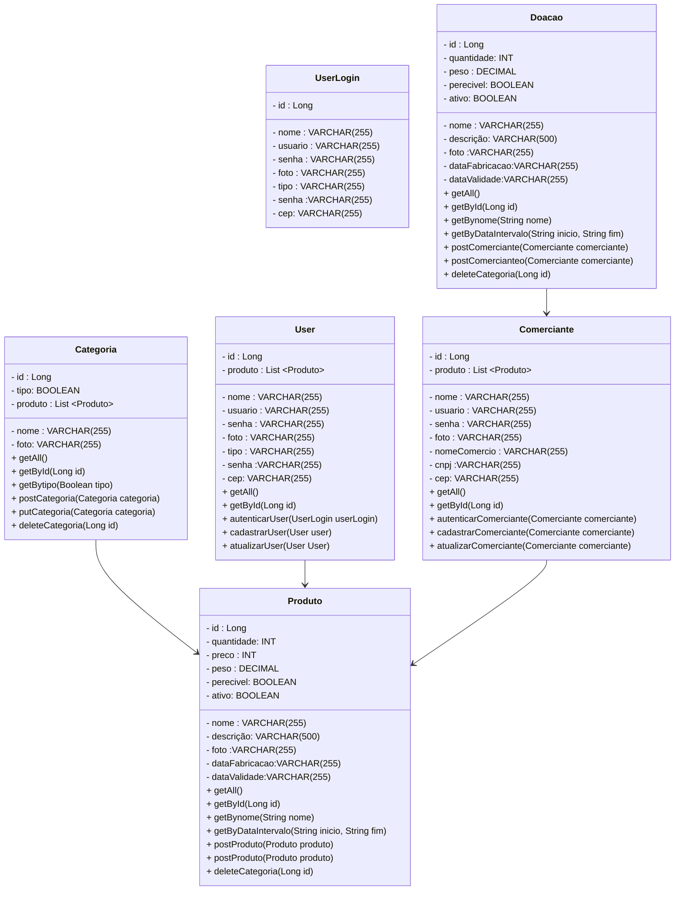

 ## Processo da implementação do projeto TAI
  
  

- [] Criar a Camada Model, repository, controler, service das Tabela Categoria,Produto,User,UserLogin, Comerciante e doação.
- [] Criar Camada de Security,BasicSecurityConfig, UserDetailsServiceImpl, UserDetailsServiceImpl.
- [] Criar as camadas controller e repository teste JUnit.
- [] Configurar os application.properties e adicionado as applications Dev.properties e prod.properties na pasta src/main/resources para o deploy no heroku.
- [] Criar a camada swaggerConfiguration para o deploy no heroku. 
- [] Executar os testes no Insomnia tanto em Dev como em Prod.             

 
 

 
<h3 align="center">
DER: Modelo de Entidade-Relacionamento :
  

